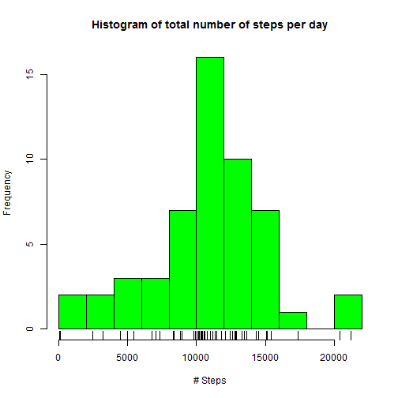
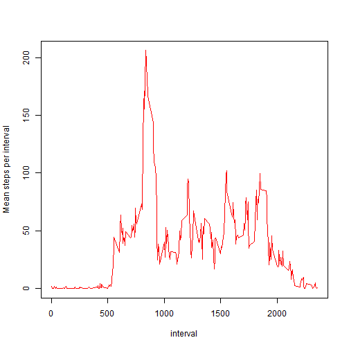
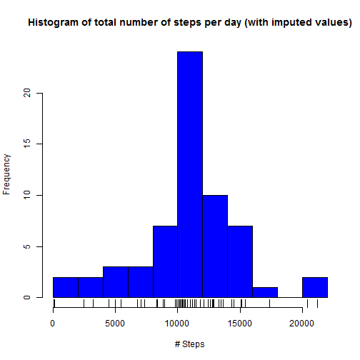
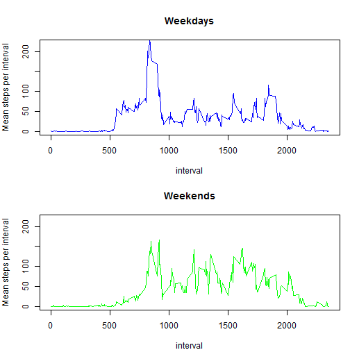

Reproducible Research: Peer Assessment 1 (repdata-032)
======================================================

## Loading and preprocessing the data
The data is loaded from the named csv file after testing whether the file exists.
The date string is converted to a POSIX date field for easier processing later.

```r
library (dplyr)
inpfile<-"activity.csv"
if(!file.exists(inpfile)) {
    msg<-paste(inpfile, "does not exist", sep=" ")
	stop(msg)
}
theData<-read.csv(inpfile, header=TRUE, na.strings="NA",stringsAsFactors=FALSE)
theData$date<-as.Date(theData$date,"%Y-%m-%d")
```

## What is the mean total number of steps taken per day?
### Calculate the total number of steps taken per day and eliminate the NA data

```r
totals<-group_by(theData,date)
totals<-summarize(totals,daysteps=sum(steps))
completes<-complete.cases(totals)
totals<-totals[completes,]
summary(totals$daysteps)
```

```
##    Min. 1st Qu.  Median    Mean 3rd Qu.    Max. 
##      41    8841   10760   10770   13290   21190
```
### Make a histogram of the total number of steps taken each day

```r
hist(totals$daysteps,breaks=10,col="green",main="Histogram of total number of steps per day",xlab="# Steps")
rug(totals$daysteps)
```

 

### Calculate and report the mean and median of the total number of steps per day

```r
summarytotals<-data.frame(val = unclass(summary(totals$daysteps)))
mean1<-summarytotals["Mean",]
median1<-summarytotals["Median",]
msg<-paste("The mean of the total number of steps per day is:", mean1)
print(msg)
```

```
## [1] "The mean of the total number of steps per day is: 10770"
```

```r
msg<-paste("The median of the total number of steps per day is:", median1)
print(msg)
```

```
## [1] "The median of the total number of steps per day is: 10760"
```

## What is the average daily activity pattern?
### Make a time series plot of the 5-minute interval and the average number of steps taken across all days

```r
good<-complete.cases(theData)
goodData<-theData[good,]
intervals<-group_by(goodData,interval)
intervals<-summarize(intervals,meansteps=mean(steps))
with (intervals, plot(interval,meansteps,type="l",col="red",ylab="Mean steps per interval"))
```

 

### Which 5 minute interval, on average across all the days in the dataset contains the maximum number of steps?

```r
maxsteps<-max(intervals$meansteps)
maxinterval<-intervals[intervals$meansteps==maxsteps,]
```
The interval containing on average the maximum number of steps is the one at 835 (206.1698113 steps).


## Imputing missing values
### Calculate and report the total number of missing values in the dataset (total number of rows containing NAs)

```r
good<-complete.cases(theData)
incompleteData<-theData[!good,]
nRowsIncomplete<-length(incompleteData[,1])
```
There are 2304 rows containing NAs

### Fill in all the missing values in the incomplete dataset, using the mean for the specific interval across all the days as calculated above (intervals)


```r
for (i in 1:length(incompleteData$steps)) {
    incompleteData[i,1]<-intervals[intervals$interval==incompleteData$interval[i],2]
}
```

### Create a new data set that is equal to the original dataset but with the missing data filled in by combining the complete and (previously) incomplete datasets

```r
completeData<-theData[good,]
newData<-rbind(completeData,incompleteData)
newData<-newData[order(newData$date),]
```

### Make a histogram of the total number of steps taken each day 

```r
newtotals<-group_by(newData,date)
newtotals<-summarize(newtotals,daysteps=sum(steps))
hist(newtotals$daysteps,breaks=10,main="Histogram of total number of steps per day (with imputed values)", 
    xlab="# Steps", col="blue")
rug(newtotals$daysteps)
```

 

```r
summary(newtotals$daysteps)
```

```
##    Min. 1st Qu.  Median    Mean 3rd Qu.    Max. 
##      41    9819   10770   10770   12810   21190
```

```r
summarynewtotals<-data.frame(val = unclass(summary(newtotals$daysteps)))
mean2<-summarynewtotals["Mean",]
median2<-summarynewtotals["Median",]
if(mean1==mean2) {
	msg1<-paste("The mean is unchanged by imputed missing values: ", mean1)
} else {
    msg1<-paste("The mean with imputed missing values has changed to", mean2, "from", mean1)
}
if(median1==median2) {
	msg2<-paste("The median is unchanged by imputed missing values:", median1)
} else {
    msg2<-paste("The median with imputed missing values has changed to", median2, "from", median1)
}
print(msg1)
```

```
## [1] "The mean is unchanged by imputed missing values:  10770"
```

```r
print(msg2)
```

```
## [1] "The median with imputed missing values has changed to 10770 from 10760"
```

## Are there differences in activity patterns between weekdays and weekends?

### Create a new factor variable in the dataset with two levels - "weekday" and "weekend" (as determined by the date)

```r
newData$daytype<-ifelse(weekdays(newData$date)=="Saturday"|weekdays(newData$date)=="Sunday","Weekend","Weekday")
newData$daytype<-factor(newData$daytype,c("Weekday","Weekend"))
```

### Make a panel plot containing time series plots of the 5-minute interval (x-axis) and average number of steps taken, averaged acros all weekdays or weekend days (y-axis)
The y axis of the two plots are made the same to make visual comparison easier

```r
weekData<-newData[newData$daytype=="Weekday",]
interval1<-group_by(weekData,interval)
interval1<-summarize(interval1,meansteps=mean(steps))
weekendData<-newData[newData$daytype=="Weekend",]
interval2<-group_by(weekendData,interval)
interval2<-summarize(interval2,meansteps=mean(steps))
par(mfrow = c(2, 1), mar = c(4, 4, 4, 1))
with (interval1, plot(interval,meansteps,type="l",col="blue",ylim=c(0,220), 
    main="Weekdays",ylab="Mean steps per interval"))
with (interval2, plot(interval,meansteps,type="l",col="green",ylim=c(0,220), 
    main="Weekends", ylab="Mean steps per interval"))
```

 

A visual examinatino of the plots indicate that activity levels are in general higher on weekends between about 10h00 and 19h00.
